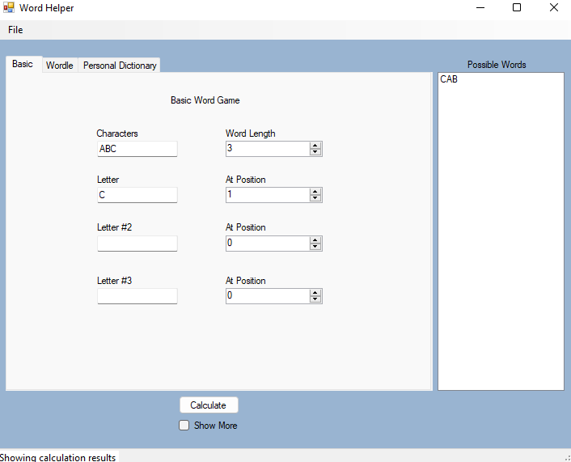

# About
Word game companion wrritten in C# using the .NET Windows Forms. This was written as the semester project for the Event-Driven Programming course in FA22 semester
at Northwest Nazarene University. This companion has three windows, the first for various word games, the second for wordle, and the third for adding or removing words
from the allowed dictionary lists. This tab can only be used while on Northwest Nazarene's network. 

## Basic Word Game 

This tab allows for users to specifiy up to 7 characters and get all permutations of all lengths that are valid words. Furthermore, users can
specify letters at specific positions, length of the word, and show ll permutations before filtered through the dictionary.

